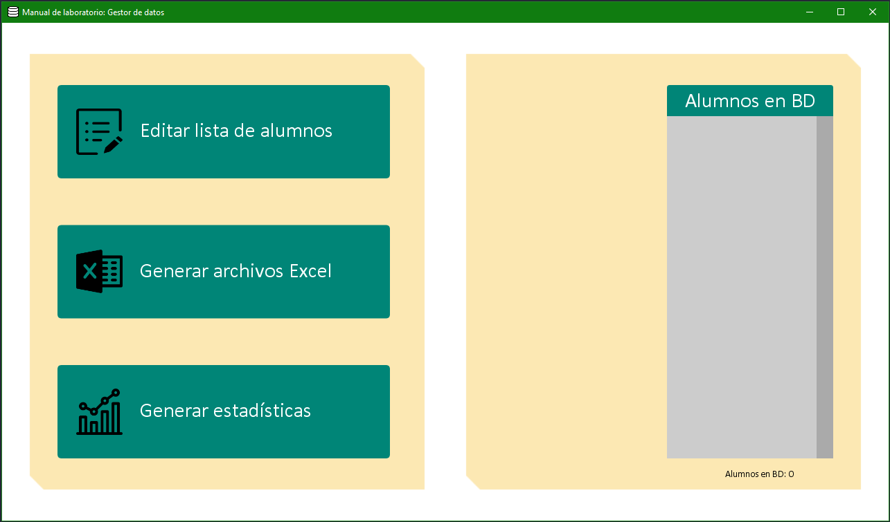

# Gestor de Usuarios

Aplicación auxiliar desarrollada como parte del Trabajo de Final del Grado de Ingeniería Informática "Sistema Informático basado en Realidad Aumentada para la realización de prácticas en el laboratorio de Resistencia de Materiales de la Escuela Superior de Ingeniería". 

Este proyecto ha sido desarrollado por Santiago Jesús Mas Peña, bajo la dirección de Milagros Huerta y Manuel Palomo. Proyecto financiado en la convocatoria de Innovación Docente de la Universidad de Cádiz 2018-20 "Proyecto de Innovación Docente de la UCA". 

Esta aplicación complementa a la aplicación de [Manual de Laboratorio](https://github.com/GRsni/Lab-Manual).

## Características

- Permite modificar la lista de alumnos con acceso permitido a la aplicación, pudiendo añadir y eliminar alumnos a la misma. Cuando un alumno es añadido a la lista de admitidos, recibe una clave de acceso en su correo electrónico, que le permite acceder a la aplicación.
- Permite recopilar y extraer los resultados de prácticas obtenidos por los alumnos, generando archivos de hoja de cálculo, separados para cada uno de los alumnos.
- Permite obtener estadísticas de uso de la aplicación móvil, y exportar fácilmente resúmenes de las respuestas a la encuesta de satisfacción.

